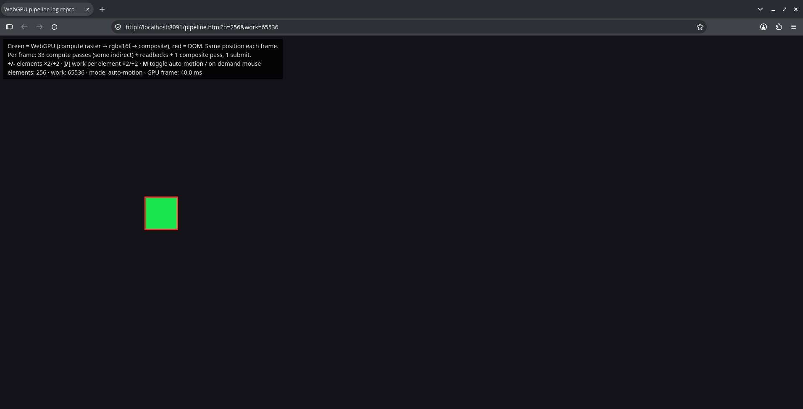
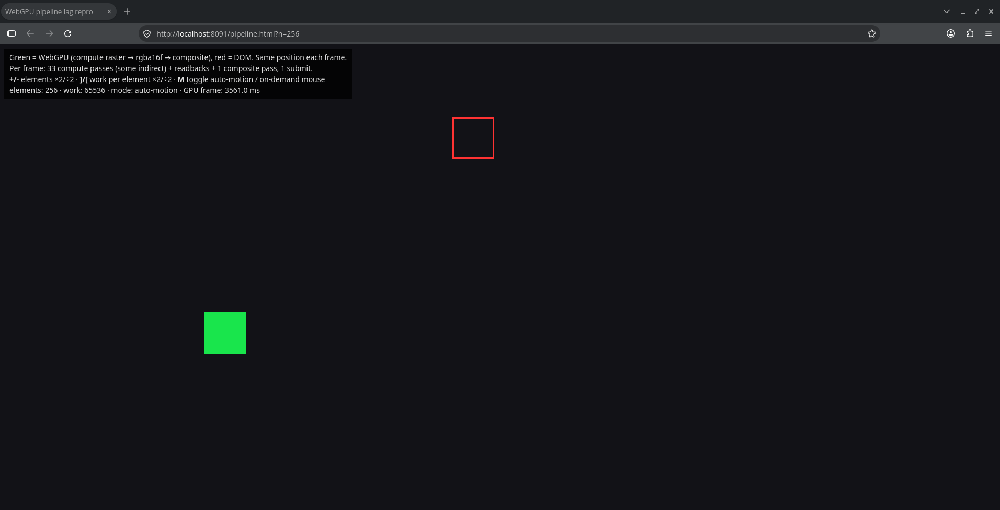
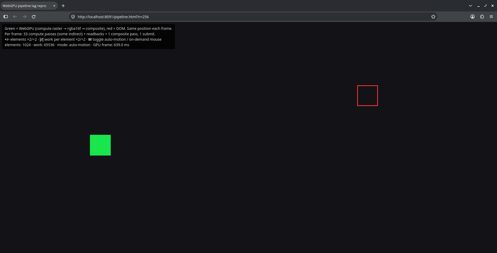

# Firefox Nightly: WebGPU canvas lags behind on Linux (DMABUF) — regression from Bug 2068330

Minimal repro for a Firefox Nightly regression on Linux: once a WebGPU canvas is GPU-bound, its presented frames fall visibly behind the rest of the page. Movement in WebGPU apps feels laggy relative to input.

**Regressed by:** [Bug 2068330 – Recycle DMABUFTextureHostOGL for WebGL/WebGPU on Linux](https://bugzilla.mozilla.org/show_bug.cgi?id=2068330) (changeset [`3dc0b00c483c`](https://hg.mozilla.org/mozilla-central/rev/3dc0b00c483ccb5bf8372c567eec313a6e67bf28))

## Repro

[`index.html`](index.html): a single file, no dependencies. Its per-frame structure copies the wgpu app where the regression was found.

1. Serve it over localhost, since WebGPU needs a secure context: `python3 -m http.server 8091`.
2. Open **`http://localhost:8091/?n=256&work=65536`**.
3. A **green square** and a **red ring** (a plain DOM element) are moved to the same position along a circle every `requestAnimationFrame`. The green square is drawn by WebGPU: a compute raster into an `rgba16float` storage texture, then composited into the canvas.

Each frame does:
- one `writeBuffer` (a camera-like uniform) and `clearBuffer` calls
- **32 compute passes**: a tiny "prep" pass that writes indirect args, alternating with a `dispatchWorkgroupsIndirect` pass doing `work` loop iterations per element
- 8 small `copyBufferToBuffer` calls into a 32-byte `MAP_READ` buffer, with `mapAsync` issued before the *next* frame's submit; plus a 4-byte readback every 30th frame, with `mapAsync` after submit
- a compute raster pass writing an `rgba16float` storage texture
- one render pass into the canvas (`viewFormats: [format]`, opaque) that samples that texture with `drawIndirect`
- **one `queue.submit`**

Controls: `+`/`-` elements ×2/÷2 (`?n=`), `]`/`[` work per element ×2/÷2 (`?work=`), `M` toggles between auto-motion and on-demand mouse follow.

**Observed** (same page, same settings `n=256&work=65536`):

| Build | Green vs red | "GPU frame" readout |
|---|---|---|
| Good (autoland `f5e66a3503c3`) | **Always together.** More elements or more work don't change that. | **~40 ms** |
| Bad (autoland `3dc0b00c483c`, Bug 2068330) | **Apart.** The canvas shows an older frame than the DOM. | **~3,500 ms** |

The "GPU frame" readout is the time from `queue.submit()` to `onSubmittedWorkDone()`, so it includes any backlog in the queue. The GPU work per frame is identical. The roughly 90× difference suggests that since Bug 2068330 there's no longer backpressure from canvas presentation to `requestAnimationFrame` (or `getCurrentTexture`) on the Linux DMABUF path. The page keeps submitting frames, the GPU queue grows to seconds, and the canvas shows a frame from seconds ago. This is an inference from the measurements, not a confirmed root cause.

`n=256` is a single workgroup per dispatch, so this isn't about massive parallel load. In the real app the same desync shows up at normal frame rates as input lag.

[`fragment-load.html`](fragment-load.html) is an earlier, simpler variant: one render pass with fragment-shader busy-work. It only shows the effect at extreme load.

> ⚠️ GPU frames of several seconds made the test machine hang or reboot several times (NVIDIA proprietary driver). Raise the load gradually.

## Screenshots

All three are at the same page and settings.

**Good build**, `n=256`, `work=65536`. Square inside the ring, GPU frame 40 ms:

**Bad build**, `n=256`, `work=65536`. Square apart from the ring, GPU frame ~3.5 s:

**Bad build**, `n=1024`, `work=65536`:

## Regression range

All tests were run with fresh profiles, so this isn't a profile or pref issue.

| Build | Revision | Result |
|---|---|---|
| Nightly 20260901103215 | `8a5eb3c1adf6` | good |
| Nightly 20260902084307 | `9730adb51ba0` | good |
| autoland | `f5e66a3503c3` (parent of the suspect) | **good** |
| autoland | `3dc0b00c483c` (Bug 2068330) | **bad** |
| Nightly 20260903090739 | `3dc0b00c483c` | bad |
| Nightly 20260905, 20260909, 20260918 | | bad |
| Nightly 20261005212256 | | still bad |

The bisect went nightlies first, then the CI builds of the commit and its parent from `gecko.v2.autoland.revision.<rev>.firefox.linux64-opt`.

## The change

Bug 2068330 adds `TSurfaceDescriptorDMABuf` to the descriptor types whose `TextureHost` gets cached on the shared surface/texture and reused, in `RemoteTextureOwnerClient::PushTexture` (`gfx/layers/RemoteTextureMap.cpp`). Before this, only D3D10 (Windows) and AndroidHardwareBuffer were recycled. Reusing the DMABUF texture host on Linux seems to lose synchronization or the ordering of presented frames once the producer is GPU-bound.

## System

- Linux 7.2.9 (CachyOS), Wayland, COSMIC desktop
- NVIDIA GeForce RTX 3060, proprietary driver 615.71.09
- Also present: NVIDIA RTX A5000 and AMD Radeon 610M (iGPU)
- Firefox Nightly 157/158 (`x86_64`, en-US)
